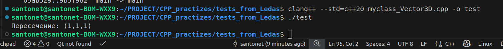

# Алгоритм поиска пересечения отрезков в 3D
Всем привет! Я, Никита, выполняю тестовое задание от Ledas. 
- Получил 24.11.25
- Сдаю 27.11.25

## Задание:
"Требуется написать функцию  Intersect, которая будет находить точку Vector3D пересечения двух заданных на вход Segment3D. В классы Vector3D и Segment3D можно добавлять любые методы."

## Цель:
Реализовать алгоритм пересечения двух отрезков. 

Очень рад этой возможности, спасибо, что даёте шанс! Мне понравилась эта вакансия тем, что я совмещаю знание математики и С++ ❤️‍🔥

## Основные шаги алгоритма:

1. **Проверка параллельности**  
   - Считаем векторное произведение направляющих векторов
   - Проверка длины произведения на близость к нулю

2. **Решение системы уравнений**  
   Уравнение: `A1 + D1×t = A2 + D2×r`

3. **Перебор комбинаций координат**
   - **XY** → проверка по Z
   - **XZ** → проверка по Y  
   - **YZ** → проверка по X

4. **Валидация решения**
   - Совпадение по третьей координате (в пределах погрешности)
   - Проверка: `t ∈ [0,1]` и `r ∈ [0,1]`

5. **Возврат результата**  
   Точка пересечения: `A1 + D1×t`

## Особенности:

- **Функция `solve2x2`** выделена для устранения дублирования кода решения линейных систем
- **Три комбинации координат** обеспечивают устойчивость к вырожденным случаям
- **Алгоритм** разбивает 3D задачу на серию 2D подзадач

## *Особенности:
т.к. сроки были для меня сжатыми, и цель: показать, а не сделать полностью идеальным.
- Переменные оставил публичными, чтобы упростить к ним доступ
- Написал всего 1 тест(возился и над выполнением его, правда). Предположу, что решение придется дорабатывать при большем кол-ве тестов

# Выполнение
На нашем тестовом наборе проверяем пересение

